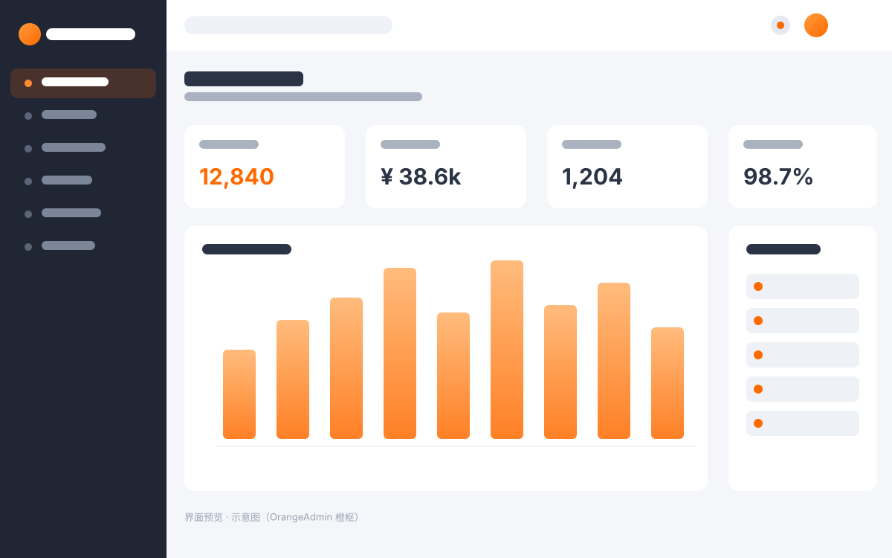
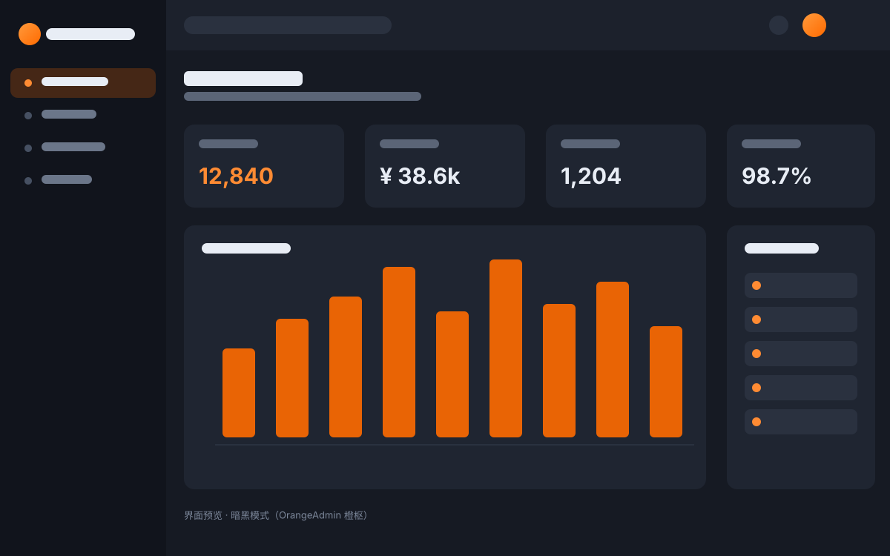

<p align="center">
  
</p>

<h1 align="center">OrangeAdmin · 橙枢</h1>

<p align="center">
  <b>接单党 / 外包团队 / 小公司的「交付利器」</b><br/>
  一套开箱即用的 Vue3 中后台模板，半天搭出专业后台，直接交差 · 纯前端 + Mock · 合规可售
</p>

<p align="center">
  
  
  
  
  
  
</p>

<p align="center">
  <a href="https://tangqicheng123.github.io/orange-admin-demo/" target="_blank">
    
  </a>
  &nbsp;
  <a href="https://github.com/tangqicheng123/orange-admin-demo" target="_blank">
    
  </a>
</p>

> 🌐 **在线 Demo**：[https://tangqicheng123.github.io/orange-admin-demo/](https://tangqicheng123.github.io/orange-admin-demo/) —— 免安装，点开即玩；**用户名任意填写，密码统一为 `123456`** 即可登录（Mock 数据）。

## 🎯 这套模板适合谁

| 你的情况 | 为什么选它 |
| --- | --- |
| 🧑‍💻 **接单 / 外包** | 客户要个后台？别从零搭，半天套这套交付，专业又快，利润留在自己口袋 |
| 🏢 **公司内部系统** |  OA / 数据看板 / 业务后台，拿去改改就能用，省下招人开发的几周成本 |
| 🚀 **SaaS / 创业起步** | 先有个能跑的多页后台验证想法，再慢慢替换，避免早期过度投入 |
| 📚 **学习 / 练手** | 看一套工程化规范的 Vue3 中后台是怎么组织的（个人学习可用 ¥19.9 档） |

> 一句话：**你负责谈单和交付，重复的前端脚手架交给我。** 把搭后台的 1~2 周，压缩到一下午。

---

## ✨ 特性

- 🚀 **现代技术栈**：Vue 3.5 + Vite 5 + TypeScript + Element Plus 2.9，类型安全、构建飞快
- 📊 **内置数据可视化**：集成 ECharts 仪表盘，开箱即用的图表组件
- 🌗 **暗黑 / 亮色双主题**：语义化颜色变量，一键切换（下图为暗黑模式）
- 📱 **移动端响应式**：侧边栏抽屉化、弹窗自适应，手机/平板/桌面全适配
- 🌐 **多语言（i18n）**：内置简体中文 / 英文，文案与结构分离
- 👤 **个人中心**：资料编辑、修改密码、Mock 本地持久化
- 🔐 **合规授权体系**：内置 EULA / 商业授权协议，售卖无忧
- 📦 **零后端依赖**：纯前端 + Mock（vite-plugin-mock），`npm i && npm run dev` 即可预览

<p align="center">
  
</p>

## 🛠 技术栈

| 分类 | 技术 |
| --- | --- |
| 框架 | Vue 3.5（`<script setup>` + Composition API） |
| 构建 | Vite 5 |
| 语言 | TypeScript 5 |
| UI 组件 | Element Plus 2.9 |
| 状态管理 | Pinia 2.2 |
| 路由 | Vue Router 4.4 |
| 图表 | ECharts 5.6 |
| 国际化 | vue-i18n 9.14 |
| 请求 | Axios 1.7 |
| Mock | vite-plugin-mock + Mock.js |
| 环境 | Node.js ≥ 18 |

## 💰 授权与定价

本模板采用**分级买断授权**，购买一次、永久使用。

| 档位 | 价格 | 说明 |
| --- | --- | --- |
| 🧑 个人版 | **¥19.9** | 个人自有非接单项目，保留版权，不可用于客户交付 |
| 🏢 商业版（推荐） | **¥399** | **商业授权 + 去版权 + 移动端 + 多语言 + 全功能**，接单交付 / 客户项目首选 |
| 🚀 扩展版 | **¥1499** | 企业多项目 / SaaS + 优先技术支持 + 定制开发 |

**权益对比**

| 功能 | 个人版 | 商业版 | 扩展版 |
| --- | --- | --- | --- |
| 完整源码（含 Mock） | ✓ | ✓ | ✓ |
| 商业使用授权（可交付客户） | ✗（限个人） | ✓ | ✓ |
| 去除版权标识 | ✗ | ✓ | ✓ |
| 移动端响应式 | ✗ | ✓ | ✓ |
| 多语言 i18n | ✗ | ✓ | ✓ |
| 技术支持 | 社区 | 邮件 | 优先 |
| 后续更新 | ✓ | ✓ | ✓ |

## 📮 获取方式与联系

本仓库为 **产品展示 / 引流仓库**，仅包含界面预览与说明，**不含完整源码**。完整可运行源码请通过以下方式购买后获取：

- 📧 **邮箱**：[1635409114@qq.com](mailto:1635409114@qq.com)
- 💬 **微信**：`tqc18537919248`（添加备注「OrangeAdmin」）
- 🐙 GitHub：暂未开源完整源码，可加微信交流

购买后你将获得：完整源码仓库、Mock 数据、部署文档与对应档位的技术支持。

## 📘 文档与快速开始

- **在线文档**：Demo 内「帮助中心 → 开发文档」含快速开始、目录结构、主题、i18n、RBAC、Mock、部署说明（进 Demo 后左上角菜单打开）。
- **免费社区版源码**：[orange-admin-community](https://github.com/tangqicheng123/orange-admin-community) —— clone 即跑，仅限学习/评估，**禁商用**。
- **社区版快速开始**：
  ```bash
  npm install --legacy-peer-deps
  npm run dev   # 任意用户名 + 密码 123456 登录
  ```

## 🛟 支持与更新承诺

- **响应时效**：邮件 / 微信咨询 **1–2 个工作日内**回复。
- **版本化更新**：Pro 持续迭代，版本化发布（当前 **v1.0.0**），历史变更见 `CHANGELOG.md`。
- **覆盖范围**：对应档位的技术支持 + 后续版本更新；定制开发另议。
- **授权保障**：商业版附《商业授权书》与去版权标识，可合法将后台交付给客户项目。

## ⚠️ 版权声明

OrangeAdmin（橙枢）为**闭源商业产品**，著作权归作者所有。

- 本展示仓库中的图片为**界面示意**，用于功能演示，不构成源码授权。
- 未经授权，不得以任何形式复制、分发、转售本模板的完整或部分源码。
- 详细条款见随源码附带的《OrangeAdmin 商业授权协议》与《最终用户许可协议（EULA）》。

---

<p align="center">
  Made with ❤️ by 唐少 · OrangeAdmin 橙枢
</p>
